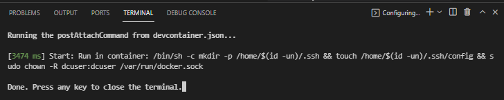
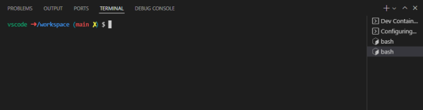
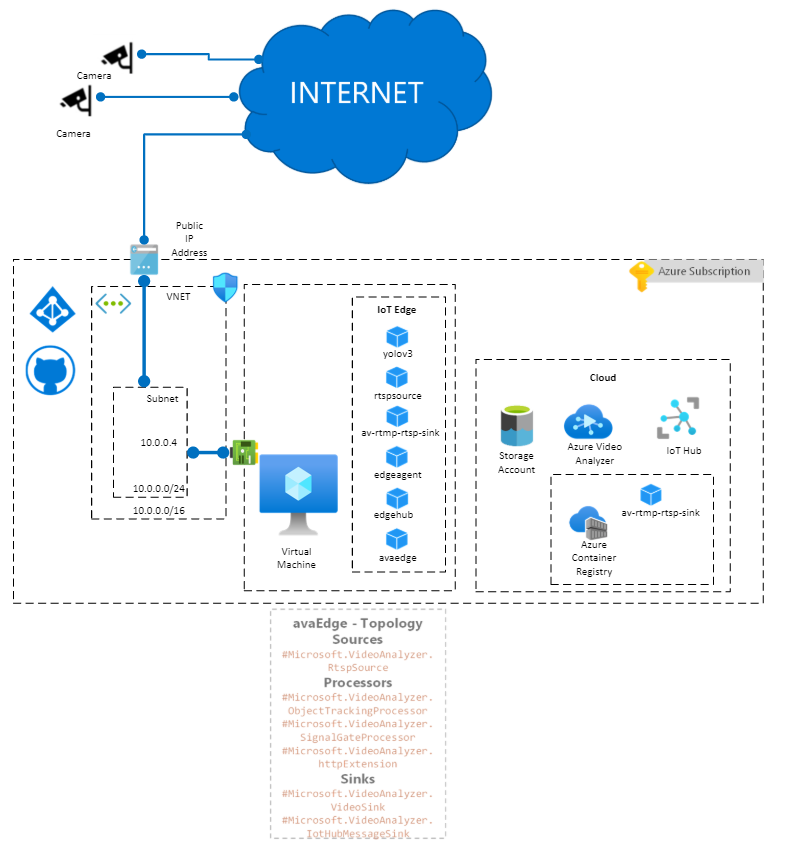
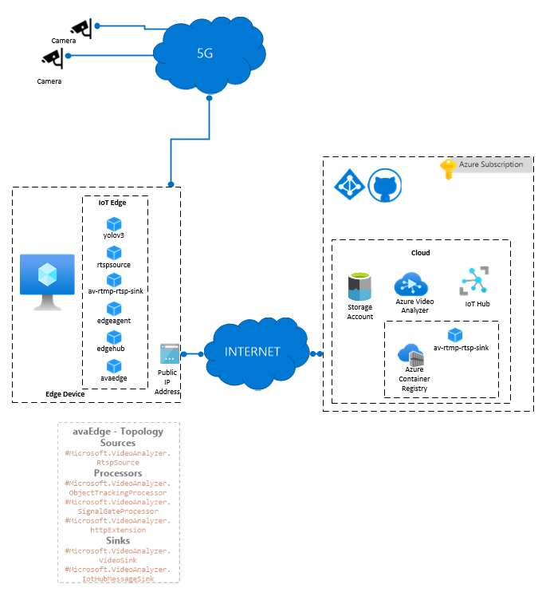
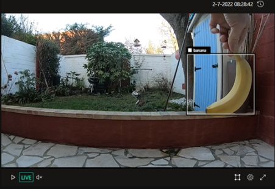
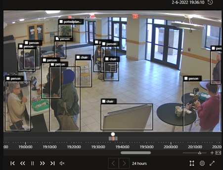

# Architecture of computer vision demonstration based on Azure Video Analyzer and Azure IoT

## Introduction

The goal of the computer vision demonstration based on Azure Video Analyzer and Azure IoT is to help you become familiar with the computer vision scenario.

Another way to get familiar with a similar deployment is to go through one of the following tutorials:
- [Quickstart: Get started with Video Analyzer in the portal](https://docs.microsoft.com/en-us/azure/azure-video-analyzer/video-analyzer-docs/edge/get-started-detect-motion-emit-events-portal)
- [Quickstart: Get started with Azure Video Analyzer](https://docs.microsoft.com/en-us/azure/azure-video-analyzer/video-analyzer-docs/edge/get-started-detect-motion-emit-events)
This deployment is with IoT Edge Runtime. Other deployments will include an Arc Enabled Kubernetes for the Edge, or private 5G simulation for the connection between the camera and the Edge.
There are many other ways to handle cameras, ML models, deployments. See <https://github.com/flecoqui/av-services> for examples of that. Here we try to make things simple first, at the cost of losing possible functionalities of the product and the architecture.

This document describe how to build, deploy and test the computer vision demonstration based on Azure Video Analyzer, Azure IOT Edge running in a Virtual Machine in Azure.
This demonstration support the following features:
- Support RTMP Camera or emulation with GoPro, Phone or ffmpeg running on PC, Mac, ...
- Recognition Pipeline supporting Object Tracking
- Archive of video in the cloud on Azure Storage
- Archive of the IoT Hub events in the cloud on Azure Storage

The container converting RTMP stream into RTSP stream is called av-rtmp-rtsp-sink.
The ubuntu flavor of this container is installed by default.
It's a container running nginx RTMP server which converts an incoming RTMP stream into RTMP stream, HLS stream and RTSP stream. Moreover, the server hosts a basic HTML page to play the HLS content.
This container is used in IoT Edge device with Azure Video Analyzer to convert an incoming RTMP stream into a RTSP stream to feed Azure Video Analyzer AI components.
When you will deploy this component with avtool.sh, it will deploy a complete AVA infrastructure with IoT Edge Hub, Azure Container Registry, Azure Media Services (so far mandatory to deploy Azure Video Analyzer), Azure Storage, Azure Virtual Machine acting as IoT Edge device and running docker.
When you will start, stop this component with avtool.sh, it will start, stop the rtmpsource container in the IoT Edge device.
When you will test this component with avtool.sh, it will test automatically the following scenarios:
- RTMP to RTSP adaptor
- AVA Object Tracking

At least, when the rtmpsource will be fed with a Live RTMP stream, you could consume the following streams with VLC:  
RTMP URL: rtmp://\<IoTEdgeVMName\>.\<REGION\>.cloudapp.azure.com:1935/live/stream  
RTSP URL: rtsp://\<IoTEdgeVMName\>.\<REGION\>.cloudapp.azure.com:8554/rtsp/stream  

## Installing the pre-requisites

In order to deploy and test this solution we recommend to use Docker, Visual Studio Code with a dev container.
This chapter describes how to install Git, Docker, Terraform and Visual Studio Code on Windows, MacOS and Linux.

### Installing Git

Git client will be required to clone the repository on your local machine. Git client can installed on Windows, MacOS, Linux.

[Installing Git on several platform](https://git-scm.com/book/en/v2/Getting-Started-Installing-Git)

### Installing Docker and Visual Studio Code

|[](https://www.docker.com/products/docker-desktop)|[](https://docs.docker.com/get-docker/)|[](https://www.docker.com/products/docker-desktop)|
| :--- | :--- | :--- |
| [Docker Desktop](https://www.docker.com/products/docker-desktop) 2.0+ on Windows 10 Pro/Enterprise. Windows 10 Home (2004+) requires Docker Desktop 2.3+ and the [WSL 2 back-end](https://docs.docker.com/desktop/windows/wsl/). (Docker Toolbox is not supported. Windows container images are not supported.) [Visual Studio Code](https://code.visualstudio.com/docs/setup/windows)|  [Docker CE/EE](https://docs.docker.com/get-docker/) 18.06+ and [Docker Compose](https://docs.docker.com/compose/install/) 1.21+. (The Ubuntu snap package is not supported.) [Visual Studio Code](https://code.visualstudio.com/docs/setup/linux) &nbsp;&nbsp; &nbsp;&nbsp; &nbsp;&nbsp; &nbsp;&nbsp; &nbsp;&nbsp; &nbsp;&nbsp; &nbsp;&nbsp; &nbsp;&nbsp; &nbsp;&nbsp; &nbsp;&nbsp; &nbsp;&nbsp; &nbsp;&nbsp; &nbsp;&nbsp; &nbsp;&nbsp; &nbsp;&nbsp; &nbsp;&nbsp; &nbsp;&nbsp; &nbsp;&nbsp; &nbsp;&nbsp; &nbsp;&nbsp; &nbsp;&nbsp; &nbsp;&nbsp; &nbsp; &nbsp;&nbsp; &nbsp;&nbsp; &nbsp;&nbsp; &nbsp;&nbsp; &nbsp;&nbsp; &nbsp;&nbsp; &nbsp;&nbsp; &nbsp;&nbsp; &nbsp;&nbsp; &nbsp;&nbsp; &nbsp;&nbsp; &nbsp;&nbsp; &nbsp;&nbsp; &nbsp;&nbsp; &nbsp;&nbsp; &nbsp;&nbsp; &nbsp;&nbsp; &nbsp;&nbsp; &nbsp;&nbsp; &nbsp;&nbsp; &nbsp;&nbsp; &nbsp;&nbsp; &nbsp;&nbsp; &nbsp;&nbsp; &nbsp;&nbsp; &nbsp;&nbsp; &nbsp;&nbsp; &nbsp;&nbsp; &nbsp;&nbsp; &nbsp;&nbsp; &nbsp;&nbsp; &nbsp;&nbsp; &nbsp;&nbsp; &nbsp;&nbsp; &nbsp;&nbsp; &nbsp;&nbsp; &nbsp;&nbsp; &nbsp; &nbsp;&nbsp; &nbsp;&nbsp; &nbsp;&nbsp; &nbsp;&nbsp; &nbsp;&nbsp; &nbsp;&nbsp; &nbsp;&nbsp; &nbsp;&nbsp; &nbsp;&nbsp; &nbsp;&nbsp; &nbsp;&nbsp; &nbsp;&nbsp; &nbsp;&nbsp; &nbsp;&nbsp; &nbsp;&nbsp; &nbsp;&nbsp; &nbsp;&nbsp; &nbsp;&nbsp; &nbsp;&nbsp; &nbsp;&nbsp; &nbsp;&nbsp; &nbsp;&nbsp; &nbsp;&nbsp; &nbsp;&nbsp; &nbsp;&nbsp; &nbsp;&nbsp; &nbsp;&nbsp; &nbsp;&nbsp; &nbsp;&nbsp; &nbsp;&nbsp; &nbsp;&nbsp; &nbsp;&nbsp; &nbsp;&nbsp; &nbsp;&nbsp; &nbsp;&nbsp; &nbsp;&nbsp; &nbsp;&nbsp; &nbsp; &nbsp;&nbsp; &nbsp;&nbsp; &nbsp;&nbsp; &nbsp;&nbsp; &nbsp;&nbsp; &nbsp;&nbsp; &nbsp;&nbsp; &nbsp;&nbsp; &nbsp;&nbsp; &nbsp;&nbsp; &nbsp;&nbsp; &nbsp;&nbsp; &nbsp;&nbsp; &nbsp;&nbsp; &nbsp;&nbsp; &nbsp;&nbsp; &nbsp;&nbsp; &nbsp;&nbsp; &nbsp;&nbsp; &nbsp;&nbsp; &nbsp;&nbsp; &nbsp;&nbsp; &nbsp;&nbsp;    | [Docker Desktop](https://www.docker.com/products/docker-desktop) 2.0+. [Visual Studio Code](https://code.visualstudio.com/docs/setup/mac) &nbsp;&nbsp; &nbsp;&nbsp; &nbsp;&nbsp; &nbsp;&nbsp; &nbsp;&nbsp; &nbsp;&nbsp; &nbsp;&nbsp; &nbsp;&nbsp; &nbsp;&nbsp; &nbsp;&nbsp; &nbsp;&nbsp; &nbsp;&nbsp; &nbsp;&nbsp; &nbsp;&nbsp; &nbsp;&nbsp; &nbsp;&nbsp; &nbsp;&nbsp; &nbsp;&nbsp; &nbsp;&nbsp; &nbsp;&nbsp; &nbsp;&nbsp; &nbsp;&nbsp; &nbsp; &nbsp;&nbsp; &nbsp;&nbsp; &nbsp;&nbsp; &nbsp;&nbsp; &nbsp;&nbsp; &nbsp;&nbsp; &nbsp;&nbsp; &nbsp;&nbsp; &nbsp;&nbsp; &nbsp;&nbsp; &nbsp;&nbsp; &nbsp;&nbsp; &nbsp;&nbsp; &nbsp;&nbsp; &nbsp;&nbsp; &nbsp;&nbsp; &nbsp;&nbsp; &nbsp;&nbsp; &nbsp;&nbsp; &nbsp;&nbsp; &nbsp;&nbsp; &nbsp;&nbsp; &nbsp;&nbsp; &nbsp;&nbsp; &nbsp;&nbsp; &nbsp;&nbsp; &nbsp;&nbsp; &nbsp;&nbsp; &nbsp;&nbsp; &nbsp;&nbsp; &nbsp;&nbsp; &nbsp;&nbsp; &nbsp;&nbsp; &nbsp;&nbsp; &nbsp;&nbsp; &nbsp;&nbsp; &nbsp;&nbsp; &nbsp; &nbsp;&nbsp; &nbsp;&nbsp; &nbsp;&nbsp; &nbsp;&nbsp; &nbsp;&nbsp; &nbsp;&nbsp; &nbsp;&nbsp; &nbsp;&nbsp; &nbsp;&nbsp; &nbsp;&nbsp; &nbsp;&nbsp; &nbsp;&nbsp; &nbsp;&nbsp; &nbsp;&nbsp; &nbsp;&nbsp; &nbsp;&nbsp; &nbsp;&nbsp; &nbsp;&nbsp; &nbsp;&nbsp; &nbsp;&nbsp; &nbsp;&nbsp; &nbsp;&nbsp; &nbsp;&nbsp; &nbsp;&nbsp; &nbsp;&nbsp; &nbsp;&nbsp; &nbsp;&nbsp; &nbsp;&nbsp; &nbsp;&nbsp; &nbsp;&nbsp; &nbsp;&nbsp; &nbsp;&nbsp; &nbsp;&nbsp; &nbsp;&nbsp; &nbsp;&nbsp; &nbsp;&nbsp; &nbsp;&nbsp; &nbsp; &nbsp;&nbsp; &nbsp;&nbsp; &nbsp;&nbsp; &nbsp;&nbsp; &nbsp;&nbsp; &nbsp;&nbsp; &nbsp;&nbsp; &nbsp;&nbsp; &nbsp;&nbsp; &nbsp;&nbsp; &nbsp;&nbsp; &nbsp;&nbsp; &nbsp;&nbsp; &nbsp;&nbsp; &nbsp;&nbsp;  |

## Installing the project

### Clone the repository

For you local machine running Windows or MacOS or Linux, open a Terminal and run the following command.

1. Create a directory to copy the repository

      mkdir myproject

      cd myproject

2. Clone the repository

      git clone <https://CSECodeHub@dev.azure.com/CSECodeHub/499949%20-%20HO%20%20MC%205G%20initiative/_git/499949%20-%20HO%20%20MC%205G%20initiative>

### Launch Visual Studio Code with the dev container

1. In the same terminal, navigate to the project folder

      cd sharing-data-rest-api

2. Launch Visual Studio Code from your terminal with the following command:

      code .

3. A first dialog box will appear asking the question "Do you trust the authors of the files in this folder?", click on the Yes button.

    

4. A second dialog box will appear asking whether you want to open the project with a dev container. Click on the button "reopen in container"

    

5. Visual Studio Code will build the dev container. After few minutes, the dev container has been built, you you can open a shell running on this dev container

    

6. Select the sub menu "New Terminal" in the menu "Terminal".

    

7. Select the sub menu "New Terminal" in the menu "Terminal". The Terminal appears, and you can use linux shell commands like "ls -l"

    

8. You are now ready to:
   - deploy/undeploy the infrastructure,
   - start/stop the RTMP/RTSP adaptor
   - launch the integration tests  
  The Dev Container is configured to support the following tools:
   - Azure CLI
   - Docker CLI
   - docker-compose
   - python/pip

## Architecture

This chapter describes the Azure Architecture deployed for this scenario.

If you don't have any device to run IoT Edge on a local machine (Azure Stack Edge), you can run IoT Edge in a Virtual Machine running in Azure.
The default deployment will deploy the following Azure resources:
**In the cloud**:
- Azure IOT Hub to manage remotely IOT edge
- Azure Video Analyzer to manage remotely the Azure Video Analyzer containers running in IoT Edge
- Azure Container Registry to host the image of the RTMP to RTSP adaptor container (av-rtmp-rtsp-sink)
- Azure Storage where the videos and events captured at the edge will be archived

**At the edge**:
- Azure Virtual Machine running Ubuntu 20.04 and IOT Edge. Moreover, the following containers are deployed in IoT Edge: avaedge, edgeagent, edgehub, av-rtmp-rtsp-sink, rtspsource, yolov3
- Virtual Network, Network Security Group, Public IP Address



Once the Azure resources are deployed, you can define the Azure Video Analyzer pipeline. For instance, you can decide whether you want to activate motion detection, object tracking, video recording or event recording in the cloud.  

If you have a device to run IoT Edge on a local machine (like Azure Stack Edge for instance), the diagram below represent the architecture of your deployment.



## Deploying and testing a RaaS scenario based on Azure Video Analyzer and Azure IoT Edge in Azure

### Installing the pre-requisites on the host machine

As avtool.sh is a Linux bash file, you could run this tool from a machine or virtual machine running Ubuntu 20.04 LTS or from the dev container terminal in Visual Studio Code.

1. From the dev container terminal run the following commands. Run avtool.sh -a install to install the pre-requisite ffmpeg, Azure Client, Docker Client, ...

```bash
    cd ./envs/container/azure-iot-edge/ava-rtmp-rtsp-sink
    ./avtool.sh -a install
```

### Deploying/Undeploying the infrastructure

Once the pre-requisites are installed, you can deploy the Live Analytics infrastructure (IoT Edge Hub, Azure Container Registry,  Azure Storage, Azure Virtual Machine acting as IoT Edge device and running docker) and build the av-rtmp-rtsp-sink ubuntu container.

You are now ready to launch the deployment. Before launching the command './avtool.sh -a deploy' to deploy the infratructure for the first time, check there is no file called '.avtoolconfig' in the folder where avtool.sh is installed. The file '.avtoolconfig' contains all the variables used to perform the deployment. If there is already a file '.avtoolconfig' from a previous deployment in the folder, remove this file before launching deployment.

1. Run the following command to build and run the container

```bash
    ./avtool.sh -a deploy
```

When you run avtool.sh for the first time, it creates a file called .avtoolconfig to store the av-rtmp-rtsp-sink in AVA configuration. By default, the file contains these parameters:

```bash
AV_PREFIXNAME="rtmprtspava$(shuf -i 1000-9999 -n 1)"
AV_RESOURCE_GROUP=${AV_PREFIXNAME}-rg
AV_RESOURCE_REGION=eastus2
AV_SERVICE=av-rtmp-rtsp-sink
AV_FLAVOR=ubuntu
AV_IMAGE_NAME=${AV_SERVICE}-${AV_FLAVOR} 
AV_IMAGE_FOLDER=av-services
AV_CONTAINER_NAME=${AV_SERVICE}-${AV_FLAVOR}-container
AV_EDGE_DEVICE=${AV_PREFIXNAME}-device
AV_EDGE_MODULE=${AV_PREFIXNAME}-device
AV_PATH_RTMP=live/stream
AV_VMNAME="$AV_PREFIXNAME"vm
AV_HOSTNAME="$AV_VMNAME"."$AV_RESOURCE_REGION".cloudapp.azure.com
AV_CONTAINERNAME=avchunks
AV_LOGIN=avvmadmin
AV_PASSWORD={YourPassword}
AV_COMPANYNAME=contoso
AV_PORT_HLS=8080
AV_PORT_HTTP=80
# use 8443 for SSL port to avoid conflict on IoT Edge with EdgeHub port
AV_PORT_SSL=8443
AV_PORT_RTMP=1935
AV_PORT_RTSP=8554
AV_TEMPDIR=$(mktemp -d)
ssh-keygen -t rsa -b 2048 -f ${AV_TEMPDIR}/outkey -q -P ""
AV_AUTHENTICATION_TYPE="sshPublicKey"
AV_SSH_PUBLIC_KEY="\"$(cat ${AV_TEMPDIR}/outkey.pub)\""
AV_SSH_PRIVATE_KEY="\"$(cat ${AV_TEMPDIR}/outkey)\""
AV_TEST_OPERATION="./operations.tracking.template.json"
AV_TEST_DEPLOYMENT="./deployment.tracking.json"
AV_TEST_VIDEO="https://avamedia.blob.core.windows.net/public/camera-300s.mkv"
AV_TEST_VIDEO_NAME="sample-tracking-video-001"
```

Below further information about the input parameters in the file .avtoolconfig:
It's important before running './avtool.sh -a deploy' to know that the variable AV_PREFIXNAME is used to name all the Azure resources deployed. As the Azure Container Registry name and the virtual machine name depends on this prefix, if a deployment as already used the same prefix, your deployment will fail because of a name conflict in Azure. Normally, it should not be the case as by default AV_PREFIXNAME contains 4 random digits.  

Below the list of input parameters:

| Variables | Description |
| ---------------------|:-------------|
| AV_RESOURCE_GROUP | The name of the resource group where AVA infrastructure will be deployed (av-rtmp-rtsp-ava-rg by default) |
| AV_RESOURCE_REGION | The Azure region where AVA infrastructure will be deployed (eastus2 by default)  |
| AV_SERVICE | The name of the service  (by default av-rtmp-rtsp-sink)  |
| AV_FLAVOR | The flavor of this service   (by default ubuntu)  |
| AV_IMAGE_NAME | The suffix of the image name  (by default \${AV_SERVICE}-\${AV_FLAVOR}) |
| AV_IMAGE_FOLDER | The image folder, the image name will be \${AV_IMAGE_FOLDER}/\${AV_IMAGE_NAME}  |
| AV_CONTAINER_NAME | The name of the container (by default av-rtmp-rtsp-sink-ubuntu-container)  |
| AV_EDGE_DEVICE | The name of the Edge device (by default rtmp-rtsp-ava-device)  |
| AV_PREFIXNAME | The name prefix used for all the Azure resources (by default rtmprtspava)  |
| AV_VMNAME | The name of the virtual machien running IoT Edge  (by default "\$AV_PREFIXNAME"vm)  |
| AV_HOSTNAME | The host name of the container. Default value: "\$AV_VMNAME"."\$AV_RESOURCE_REGION".cloudapp.azure.com  |
| AV_CONTAINERNAME | The name of the container in Azure Storage Account where the video and audio chunks will be stored (by default avchunks)  |
| AV_LOGIN | The login for the Virtual Machine running IoT Edge. Default value: avvmadmin  |
| AV_PASSWORD | The password for the Virtual Machine running IoT Edge. Default value:   |
| AV_COMPANYNAME | The company name used to create the certificate. Default value: contoso |
| AV_HOSTNAME | The host name of the container. Default value: localhost  |
| AV_PORT_HLS | The HLS TCP port. Default value: 8080 |
| AV_PORT_HTTP | The HTTP port. Default value: 80 |
| AV_PORT_SSL | The SSL port. Default value: 443  |
| AV_PORT_RTMP | The RTMP port. Default value: 1935  |
| AV_PORT_RTSP | The RTSP port. Default value: 8554  |
| AV_TEMPDIR | The directory on the host machine used to store MKV and MP4 files for the tests |
| AV_TEST_OPERATION | The operation file which defines the AVA pipeline, by default: "./operations.tracking.template.json"
| AV_TEST_DEPLOYMENT | The deployment file which defines the list of containers to deploy, by default: "./deployment.tracking.json"
| AV_TEST_VIDEO | The video source, it could http url, local file or keyword live for camera, by default: "https://avamedia.blob.core.windows.net/public/camera-300s.mkv"
| AV_TEST_VIDEO_NAME | The name associated with the test scenario which will appear on ="sample-tracking-video-001"

When the service is running and fed with a RTMP stream, the following urls could be used for the tests:

RTMP URL: "rtmp://\<IoTEdgeVMName\>.\<REGION\>.cloudapp.azure.com:1935/live/stream"  
RTSP URL: "rtsp://\<IoTEdgeVMName\>.\<REGION\>.cloudapp.azure.com:8554/rtsp/stream"  
HLS  URL: "http://\<IoTEdgeVMName\>.\<REGION\>.cloudapp.azure.com:8080/live/stream.m3u8"  
HTTP URL: "http://\<IoTEdgeVMName\>.\<REGION\>.cloudapp.azure.com:80/player.html"  
SSL  URL: "https://\<IoTEdgeVMName\>.\<REGION\>.cloudapp.azure.com:8443/player.html"  
SSH command: "ssh \<VMAdmin\>@\<IoTEdgeVMName\>.\<REGION\>.cloudapp.azure.com"  

Below the output parameters:

| Variables | Description |
| ---------------------|:-------------|
| AV_RESOURCE_GROUP | The name of the resource group where AVA infrastructure will be deployed (av-rtmp-rtsp-ava-rg by default) |
| AV_STORAGENAME |The name of the sotrage account created|
| AV_SASTOKEN | The Shared Access Signature for the storage account|
| AV_IOTHUB | The IoT Hub name |
| AV_IOTHUB_CONNECTION_STRING |The IoT Hub connection string |
| AV_DEVICE_CONNECTION_STRING |The IoT Device connection string|
| AV_CONTAINER_REGISTRY |The Azure Container Registry name |
| AV_CONTAINER_REGISTRY_DNS_NAME |The Azure Container Registry login server name |
| AV_CONTAINER_REGISTRY_USERNAME |The Azure Container Registry user name|
| AV_CONTAINER_REGISTRY_PASSWORD |The Azure Container Registry password|
| AV_SUBSCRIPTION_ID |The Azure Subscription ID |
| AV_AVA_PROVISIONING_TOKEN |The Azure Video Analyzer provisioning token |

If the deployment fails, the environment variables are not valid anymore in .avtoolconfig, you delete the file .avtoolconfig before launching a new deployment.

### Starting/Stopping av-rtmp-rtsp-sink ubuntu service

Once the rtmpsource service is built and deployed you can start and stop this container.

1. Run the following command to start the RTMP/RTSP converter container in IoT Edge Device

   ```bash
       ./avtool.sh -a start
   ```

2. If the container is still running, you can run the following command to stop the RTMP/RTSP converter  container in IoT Edge Device

   ```bash
       ./avtool.sh -a stop
   ```

3. If the container is still running, you can run the following command to get the status of the RTMP/RTSP converter container in IoT Edge Device

   ```bash
       ./avtool.sh -a status
   ```

### Testing av-rtmp-rtsp-sink ubuntu service with object tracking in IoT Edge Device

Once the image is built you can test if the container is fully functionning.

1. Run the following command to test the container

```bash
    ./avtool.sh -a test
```

For this container, the tests will check whether the RTMP streams, HLS streams and RTSP streams are fully functionning.

By default for the tests, it will test automatically the following scenarios:
- RTMP to RTMP adaptor
- AVA Object Tracking

For this test, we use an incoming Live RTMP stream created from a MKV file using the following ffmpeg command:

```bash
    ffmpeg -hide_banner -loglevel error  -re -stream_loop -1 -i "${AV_TEMPDIR}"/camera-300s.mkv -codec copy -bsf:v h264_mp4toannexb   -f flv rtmp://${AV_HOSTNAME}:${AV_PORT_RTMP}/live/stream
```

If on the host machine a Webcam is installed, you can use this webcam to generate the incoming RTMP stream using the following ffmpeg command:

```bash
    ffmpeg.exe -v verbose -f dshow -i video="Integrated Webcam":audio="Microphone (Realtek(R) Audio)"  -video_size 1280x720 -strict -2 -c:a aac -b:a 192k -ar 44100 -r 30 -g 60 -keyint_min 60 -b:v 2000000 -c:v libx264 -preset veryfast  -profile main -level 3.0 -pix_fmt yuv420p -bufsize 1800k -maxrate 400k    -f flv rtmp://localhost:1935/live/stream
```

If you want to test specific scenario, you can still use "./avtool.sh -a test" with options to define the list of container to deploy, the input video, the AI pipeline and the name of the recording in Azure Video Analyzer.

1. Run the following command to test the motion detection with cafetaria video
   ```bash
       ./avtool.sh -a test -d ./deployment.motion.json -o ./operations.motion.template.json -v ../../../../content/cafetaria.mkv -n cafetariamotion001
   ```
2. Run the following command to test the object tracking with cafetaria video
   ```bash
       ./avtool.sh -a test -d ./deployment.tracking.json  -o ./operations.tracking.template.json -v ../../../../content/cafetaria.mkv -n cafetariatracking001
   ```
3. Run the following command to test the object tracking with live RTMP video
   ```bash
       ./avtool.sh -a test -d ./deployment.tracking.json  -o ./operations.tracking.template.json -v live -n goprotracking001
   ```
Once, all the scenario are tested, you can check the results from the Azure Portal in Azure Video Analyzer videos page.
for instance,

For instance, live video from Azure portal:  


For instance, person detection:  


## Source code exploration

### Dev container

For this scenario, the devcontainer has been updated to support:
- Docker Cli
- Azure CLI
- .Net Core SDK v6.X

The file [tools.sh](https://dev.azure.com/CSECodeHub/_git/499949%20-%20HO%20%20MC%205G%20initiative?path=/.devcontainer/tools.sh)  for the installation of those components.

The file [devcontainer.json](https://dev.azure.com/CSECodeHub/_git/499949%20-%20HO%20%20MC%205G%20initiative?path=/.devcontainer/devcontainer.json)  for the VSCode extensions installation.

### RTMP/RTSP adaptor container

For this scenario, you need a RTMP/RTSP adaptor container ubuntu flavor.

The [Dockerfile](https://dev.azure.com/CSECodeHub/_git/499949%20-%20HO%20%20MC%205G%20initiative?path=/envs/container/docker/av-rtmp-rtsp-sink/ubuntu/Dockerfile) for the ubuntu flavor.  

The [docker-entrypoint.sh](https://dev.azure.com/CSECodeHub/_git/499949%20-%20HO%20%20MC%205G%20initiative?path=/envs/container/docker/av-rtmp-rtsp-sink/ubuntu/docker-entrypoint.sh) for the ubuntu flavor.

### Deployment and test Azure Video Analyzer and Azure IoT Edge

For the deployment of the infrastructure we use the following files:
1. [avtool.sh](https://dev.azure.com/CSECodeHub/_git/499949%20-%20HO%20%20MC%205G%20initiative?path=/envs/container/azure-iot-edge/ava-rtmp-rtsp-sink/avtool.sh): a linux bash file used to deploy the infrastructure
2. [azuredeploy.iothub.json](https://dev.azure.com/CSECodeHub/_git/499949%20-%20HO%20%20MC%205G%20initiative?path=/envs/container/azure-iot-edge/ava-rtmp-rtsp-sink/azuredeploy.iothub.json): an Azure ARM Template to deploy the IOT Hub and Azure Video Analyzer
3. [azuredeploy.vm.json](https://dev.azure.com/CSECodeHub/_git/499949%20-%20HO%20%20MC%205G%20initiative?path=/envs/container/azure-iot-edge/ava-rtmp-rtsp-sink/azuredeploy.vm.json): an Azure ARM Template to deploy the Virtual Machine running IoT Edge
4. [avatool](https://dev.azure.com/CSECodeHub/_git/499949%20-%20HO%20%20MC%205G%20initiative?path=/src/avatool/avatool.csproj): a .Net Core application used to deploy Azure Video Analyzer pipeline and read the IoT Hub events. This application is called from the avtool.sh script.
5. [deployment.motion.json](https://dev.azure.com/CSECodeHub/_git/499949%20-%20HO%20%20MC%205G%20initiative?path=/envs/container/azure-iot-edge/ava-rtmp-rtsp-sink/deployment.motion.json): a json file which defines the list of containers to deploy for this recognition detecting motion pipeline.
6. [deployment.tracking.json](https://dev.azure.com/CSECodeHub/_git/499949%20-%20HO%20%20MC%205G%20initiative?path=/envs/container/azure-iot-edge/ava-rtmp-rtsp-sink/deployment.tracking.json): a json file which defines the list of containers to deploy for this recognition object tracking pipeline .
7. [operations.tracking.template.json](.https://dev.azure.com/CSECodeHub/_git/499949%20-%20HO%20%20MC%205G%20initiative?path=/envs/container/azure-iot-edge/ava-rtmp-rtsp-sink/operations.tracking.template.hybrid.json): a json file which defines the pipeline and the operations to run the test of this recognition object tracking pipeline.
8. [operations.motion.template.json](https://dev.azure.com/CSECodeHub/_git/499949%20-%20HO%20%20MC%205G%20initiative?path=/envs/container/azure-iot-edge/ava-rtmp-rtsp-sink/operations.motion.template.json): a json file which defines the pipeline and the operations to run the test of this recognition motion detection pipeline.

At least some video files (mkv files) are available under the folder ./content.
